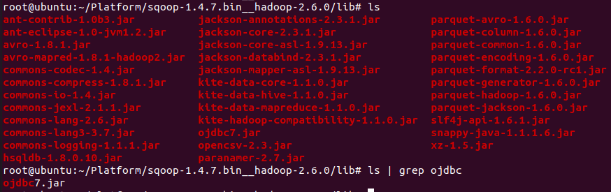

# Hadoop-Sqoop-Oracle
**Import** and **Export** between **Oracle Database** and **HDFS** using **Sqoop**

## Contents
1. [Using](#using)
2. [Sqoop Introduction](#sqoop-introduction)
3. [Sqoop Installation](#sqoop-installation)
4. [Sqoop Import](#sqoop-import)
5. [Sqoop Export](#sqoop-export)
6. [Additional error handling](#additional-error-handling)

----------------------------------------------------------------

## Using
1. **OS** - Ubuntu 20.04.1 LTS (VMware)
2. **BackEnd** - Java (JDK 1.8), **Sqoop(v1.4.7)**, **Hadoop(v3.3.0)**
3. **Library** - **OJDBC(v7), commons-lang-2.6.jar**
3. **Database** - AWS RDS, **Oracle DatabBase(12c, 12.1.0.2.v22)**

----------------------------------------------------------------

## Sqoop Introduction
1. **Sqoop**
    - 하둡 에코 시스템의 **수집 소프트웨어**
    - **RDBMS와 HDFS 간**의 효율적인 대용량 bulk **데이터 전송** 지원 도구
    - 관계형 데이터베이스에 저장되어 있는 데이터를 HDFS 하둡 엔진으로 가져오고 싶을 때 사용
    - **외부 시스템의 데이터를 HDFS로 가져와서 Hive 테이블, HBase 테이블 등 하둡의 다양한 파일 형태로 저장 가능**
    - Sqoop v2에서는 HDFS로만 저장 지원
    - **JDBC와 호환되는 모든 RDBMS에서 사용 가능** (MS SQL SERVER, PostgreSQL, MySQL, Oracle 등)
2. **Sqoop Version**
    |기능|Version 1|Version 2|
    |:------------:|:------------|:------------|
    |모든 주요 RDBMS를 위한 커넥터|지원함|지원하지 않음 / 범용 JDBC Connector를 사용|
    |Kerberos 보안 통합|지원함|지원하지 않음|
    |RDBMS에서 하이브나 HBase로 데이터 전송|지원함|지원하지 않음 / 우선 RDBMS에서 HDFS로 데이터를 가져온 후, 데이터를 다시 Hive나 HBase에 수동으로 가져와야 함|
    |하이브나 HBase에서 RDBMS로 데이터 전송|지원하지 않음 / 우선 Hive나 HBase에서 HDFS로 데이터를 내보낸 다음, 다시 Sqoop으로 내보내야 함| Version 1과 동일|
3. Sqoop v1의 유용한 기능이 Sqoop v2에서 상당수 제외되어 많은 사용자가 Sqoop v1을 사용하는 경우가 있음.

----------------------------------------------------------------

## Sqoop Installation
1. **Sqoop 압축파일 다운로드**
    ```{.bash}
    wget http://mirror.apache-kr.org/sqoop/1.4.7/sqoop-1.4.7.bin__hadoop-2.6.0.tar.gz
    ```
2. **압축 해제**
    ```{.bash}
    tar xvfz sqoop-1.4.7.bin__hadoop-2.6.0.tar.gz
    ```
3. **Sqoop과 Hadoop 연동**, sqoop-env-template.sh 를 기반으로 설정파일 생성 및 수정 <sub>sqoop-1.4.7.bin__hadoop_2.6.0을 (SQOOP_HOME)으로 가정</sub>
    ```{.bash}
    (SQOOP_HOME)/conf# cp sqoop-env-template.sh sqoop-env.sh
    (SQOOP_HOME)/conf# vi sqoop-env.sh
    ```
    **HADOOP HOME Directory** 추가
    ```{.bash}
    export HADOOP_COMMON_HOME=(HADOOP HOME PATH 작성, 작성자 기준 : ~/Platform/hadoop-3.3.0)
    export HADOOP_MAPRED_HOME=(HADOOP HOME PATH 작성, 작성자 기준 : ~/Platform/hadoop-3.3.0)
    ```
    <p align="center">
        
    </p> 
    
----------------------------------------------------------------

## Sqoop Import
1. **Import**
    1. Sqoop은 기본적으로 Hadoop에 설치가 되고, Hadoop에서 RDBMS에 JDBC를 통해서 접속을 하고 데이터를 가져온다.
    2. 가지고 올 때(Import) **MapReduce 작업 중 Map만 필요한 Job으로 구성**이 된다. **(Sqoop Job은 MapReduce 중에서 Map의 Job이 된다.)**
    3. Import 할때 RDBMS의 Meta Data(테이블의 구조, 모습, 권한, ID 등)를 가지고 있어야 한다. Meta Data를 가지고 와서 Sqoop Job을 실행시킨다.
    4. **Map이 여러 개 분산되서** 돌아가고 여기서 원하는 만큼의 분량으로 **각각의 Map이 접근**해서 데이터를 가지고 오고, 파일로 저장하는 형태
    5. **저장될 파일은 쉼표로 구분된 필드로 구성**
2. **Import 실행 순서**
    1. JDBC를 이용하기 때문에 RDBMS 버전과 맞는 **JDBC Driver**를 (SQOOP_HOME)/lib 폴더로 [다운로드](https://www.oracle.com/kr/database/technologies/appdev/jdbc.html)
        <p align="center">
            
        </p> 
    2. RDBMS에 접속해서 **테이블 리스트** 받아오기
        ```{.bash}
        (SQOOP_HOME)/bin# ./sqoop list-tables --connect jdbc:oracle:thin:@{RDS End-Point / Host}:{port number}:{SID} --username {password} --password {password}
        ```
        **작성자 기준**
        ```{.bash}
        (SQOOP_HOME)/bin# ./sqoop list-tables --connect jdbc:oracle:thin:@potato-travel.c0qsmdnmd0gr.ap-northeast-2.rds.amazonaws.com:1521:orcl --username username --password password
        ```
        <p align="center">
            
        </p> 
    3. Data **Import (RDBMS -\> HDFS)**
        1. **-m** : 몇 개의 Map Job을 만들지 설정
        2. **--target-dir** : 가져온 데이터를 HDFS 어디에 저장할 것인지 설정
        3. 명령어
            ```{.bash}
            (SQOOP_HOME)/bin# ./sqoop import --connect jdbc:oracle:thin:@{RDS End-Point / Host}:{port number}:{SID} --username {password} --password {password} --table {TABLE_NAME 대문자로 작성!!} -m 1 --target-dir {hdfs destination}
            ```
            **작성자 기준**
            ```{.bash}
            (SQOOP_HOME)/bin# ./sqoop import --connect jdbc:oracle:thin:@potato-travel.c0qsmdnmd0gr.ap-northeast-2.rds.amazonaws.com:1521:orcl --username name --password password --table coronamap -m 1 --target-dir /user/potatotravel/sqoop-oracle-import/coronamap
            ```
            <p align="center">
                
            </p>
            <p align="center">
                
            </p>
    4. **HDFS에서 파일 확인**
        ```{.bash}
        (HADOOP_HOME)# hadoop dfs -ls <hdfs destination>
        (HADOOP_HOME)# hadoop dfs -cat <file in hdfs destination>
        ```
        **작성자 기준**
        ```{.bash}
        (HADOOP_HOME)# hadoop dfs -ls /user/potatotravel/sqoop-oracle-import/coronamap
        (HADOOP_HOME)# hadoop dfs -cat /user/potatotravel/sqoop-oracle-import/coronamap/part-m-00000
        ```
        <p align="center">
            
        </p>
        <p align="center">
            
        </p>
        
----------------------------------------------------------------

## Sqoop Export
1. **Export**
    1. Import와 반대로 **HDFS에 csv 형태로 저장되어 있는 데이터를 RDBMS로 내보내는 기능**
    2. Meta Data에 접근하여 테이블이 존재하는지 확인한다.
    3. Import와 동일하게 **Map Job이 각각의 파일들을 읽어서 RDBMS에 집어넣는다.**
2. **Export 순서**
    1. 데이터를 저장할 **테이블 생성** <sub>테이블이 먼저 존재해야함.</sub>
        <p align="center">
            
        </p>
    2. Data **Export (HDFS -\> RDBMS)**
        1. **-m** : 몇 개의 Map Job을 만들지 설정
        2. **--export-dir** : HDFS의 어떤 데이터를 RDBMS로 보낼지 설정
        3. **명령어**
            ```{.bash}
            (SQOOP_HOME)/bin# 
            ./sqoop export --connect jdbc:oracle:thin:{RDS End-Point / Host}:{port number}:{port number}:{SID} --username {username} --password {password} --table {TABLE_NAME 대문자로 작성!!} -m 4 --export-dir {hdfs Source Directory}
            ```
            **작성자 기준**
            ```{.bash}
            (SQOOP_HOME)/bin# ./sqoop export --connect jdbc:oracle:thin:@potato-travel.c0qsmdnmd0gr.ap-northeast-2.rds.amazonaws.com:1521:orcl --username name --password password --table CORONAMAPEXPORT -m 4 --export-dir /user/potatotravel/sqoop-oracle-import/coronamap
            ```
            <p align="center">
                
            </p>
            <p align="center">
                
            </p>
    3. **RDBMS에서 데이터 확인**
        <p align="center">
            
        </p>
        
----------------------------------------------------------------

## Additional error handling
1. **org.apache.sqoop.tool.ImportTool – Import failed: There is no column found in the target table table_name.** 
    - table 명을 작성할 때 소문자로 작성할 경우 인식하지 못한다. **풀네임을 대문자로 작성**해야한다. ex) coronamap -\> **CORONAMAP**
    <p align="center">
        
    </p>
2. **java.lang.NoClassDefFoundError: org/apache/commons/lang3/StringUtils**
    - **Sqoop1.4.7은 기본적으로 commons-lang3-3.4.jar만 로드**한다.
    - 그렇기 때문에 **이전 버전의 jar**를 다운로드하여 SQOOP_HOME의 lib 폴더에 넣어줘야 한다.  
    - commons-lang-2.6.jar : http://mirrors.tuna.tsinghua.edu.cn/apache//commons/lang/binaries/commons-lang-2.6-bin.zip  
    <p align="center">
        
    </p>
    <p align="center">
        
    </p>